# Módulo 4 - Proyecto 4
## ¡Bienvenidos al proyecto "Reservas Hoteleras"!

## Tabla de Contenidos
* [1. Desafío](#1-Desafío)
* [2. Desarrollo de proyecto](#3-Desarrollo-de-proyecto)
* [3. Conclusiones](#4-Conclusiones)

****
## Desarrollo

### 1. Desafio
 Para este cuarto proyecto se solicita crear una aplicación de servicios CRUD para la industria hotelera, en específico para el proceso de gestión de reservas. Adicionalmentese incluye la documentación de la API, realizada por medio de Insomnia.
 Los requerimientos para este proyecto son:
- Construcción de una aplicación para gestión de reservas hoteleras, involucrando las 4 operaciones CRUD, y 6 adicionales relacionadas con filtros, utilizando Node.js y Express.
- Documentación de API, este punto era opcional,

El segundo punto era opcional, sin embargo se ha incluido en este proyecto debido a la usabilidad.
  
Y las características en detalle:
- Utilización de Node.js y Express
- Incluir archivo .env y .gitignore
- Utilizar una arquitectura de carpetas como se munestra a continuación:

 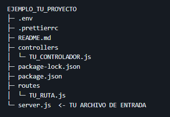
  

  ****

### 2. Desarrollo de proyecto
 Se incia con la estructura base del proyecto, con el fin de mantener esta guía durante el desarrollo de la aplicación, a continuación se muestra un extracto:
 
 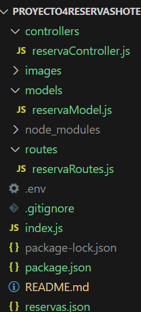

 Para los archivos .env y .gitignore se establecen los requerimientos necesarios para el desarrollo del proyecto, se muestra un extracto de ambos archivos:

 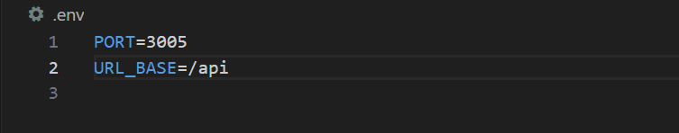
 
 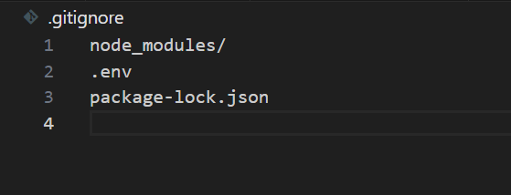
 
 Para el archivo de Models, se procede con un constructor que indica los campos requeridos para este proyecto:
 
 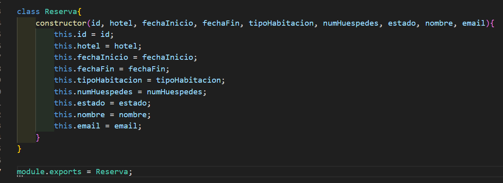

 Posterior se crea el código para el controller, al inicio se agregar un array que tiene 4 reservas guardadas como base, luego se agregaron las funciones necesarias para crear una reserva, se muestra un extracto a continuación:
 
 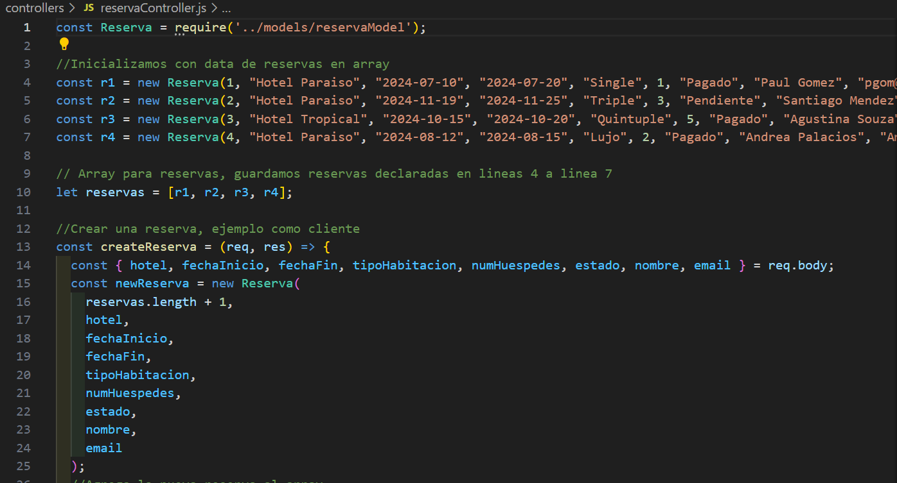

 A continuación dentro de ese mismo archivo, se crean los códigos para buscar todas las reservas y búsqueda de reservas por ID:
 
 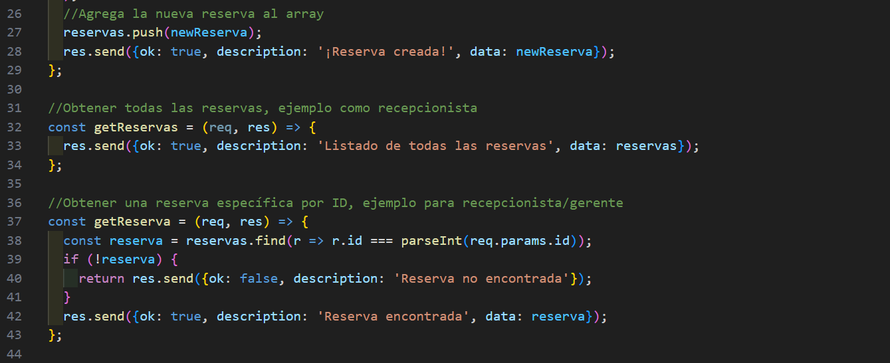

 Para la función de actualizar reservas, se incluyen parámetros de los cuales se pudiese actualizar por hotel, fechas de ingreso o egreso, así como tipo de habitación, cantidad de huéspedes, estado, nombre y mail:
 
 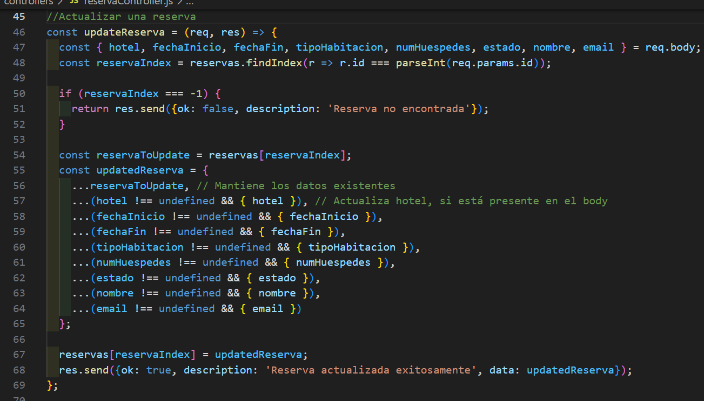

 Y para finalizar con las operaciones CRUD, se incluye la función para eliminar las reservas:
 
 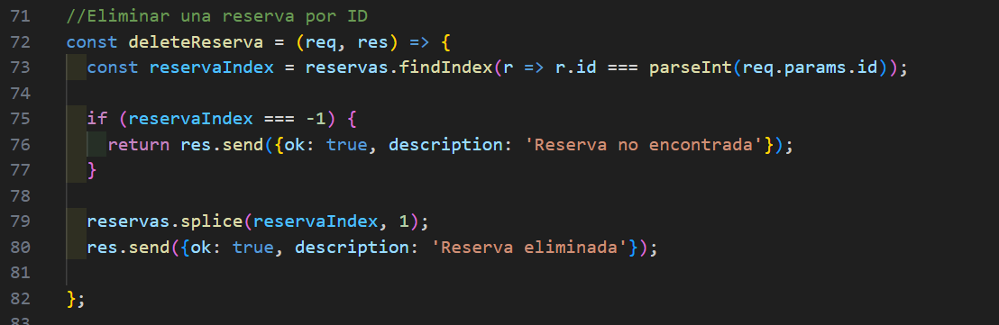

 Se crean las funciones específicas para filtrar por hotel, fechas, tipo de habitación, estado y número de huéspedes, a continuación se muestra un extracto:
 
 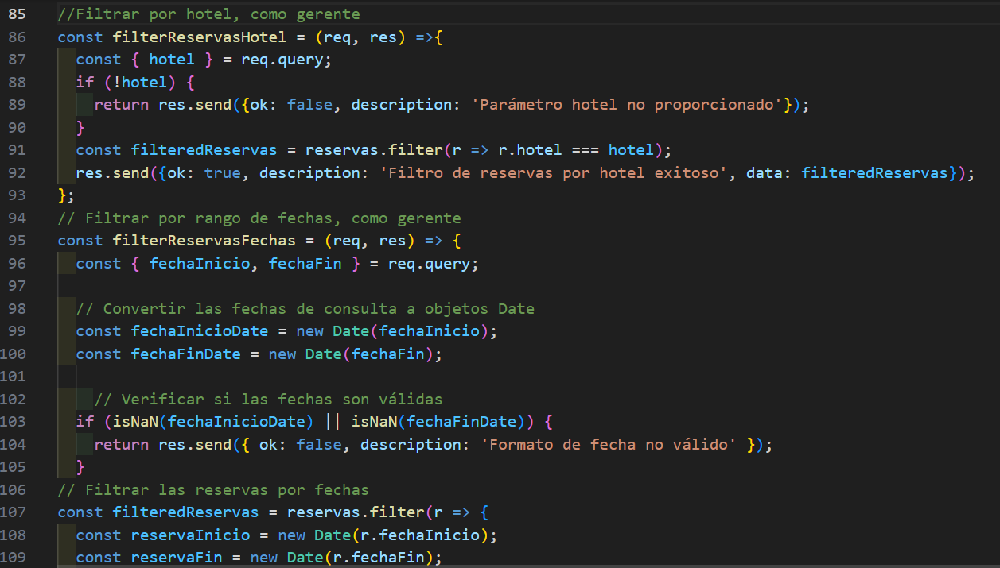

 Por último se crea el archivo de routes, con el fin de hacer las conexiones con el controller: 
 
 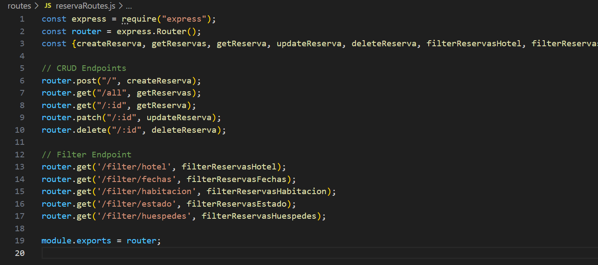
   
 Sobre la documentación de las API, utilizando insomnia, se crea en base environment la url base que se utilizará durante la ejecución del proyecto: 
 
 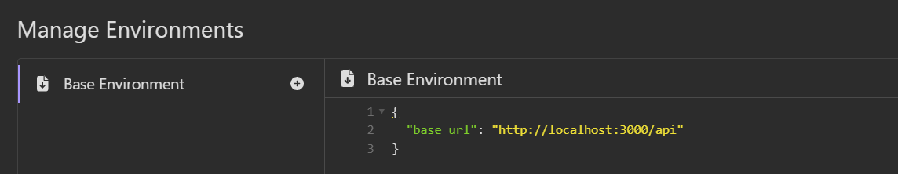

 Posterior se ejecuta para todas las reservas y reservas por ID, en base a GET para ambos:
 
 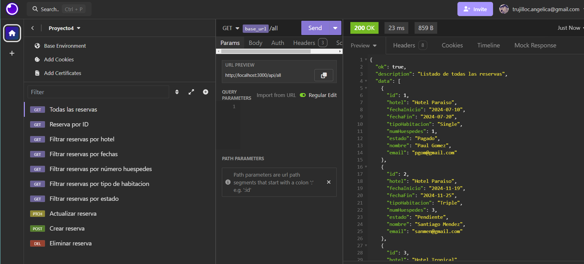

 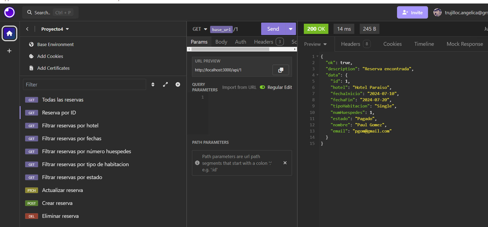

 Luego se habilita la búsqueda por hotel, fechas, cantidad de huéspedes, tipo de habitación y estado, todos en base a GET:
  
 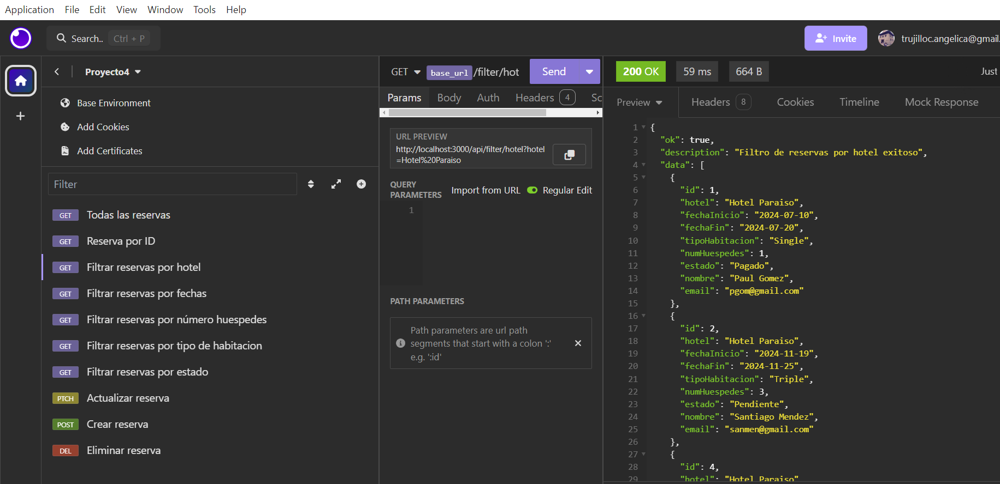

 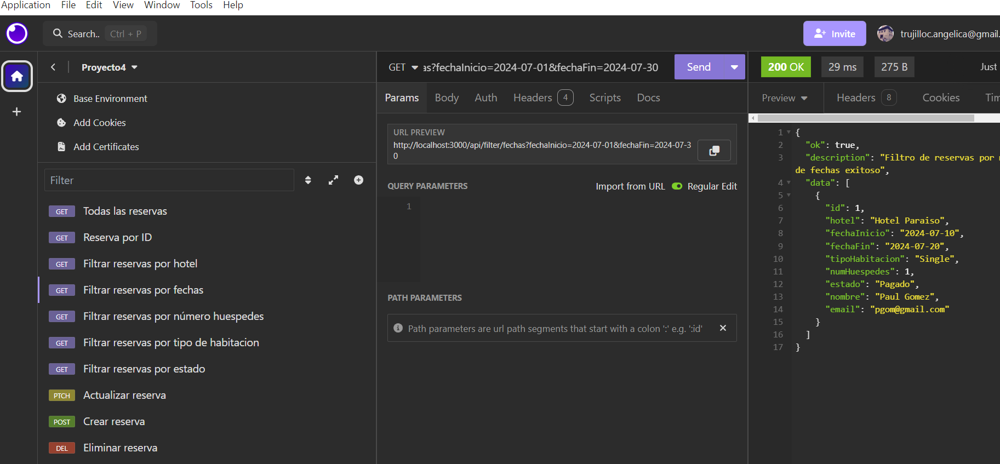

 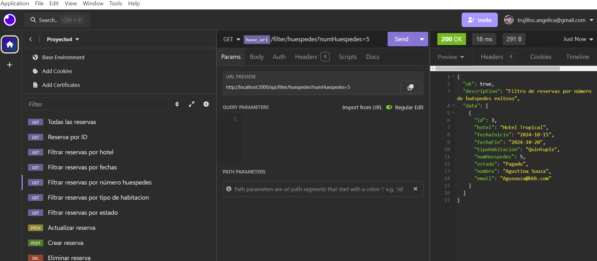

 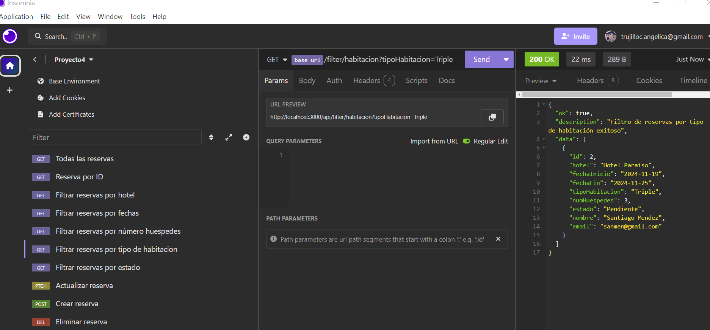
 
 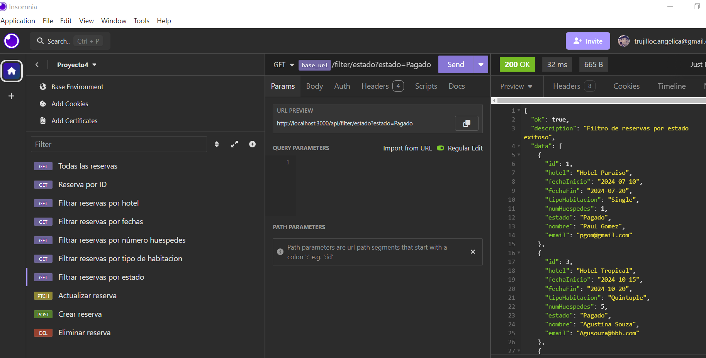

 Se crea la actualización de una reserva por medio de PATCH:

 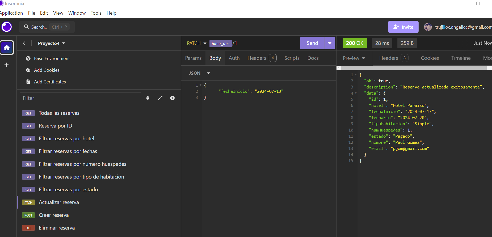

 Se habilita la creación de una reserva, por medio de POST:
 
 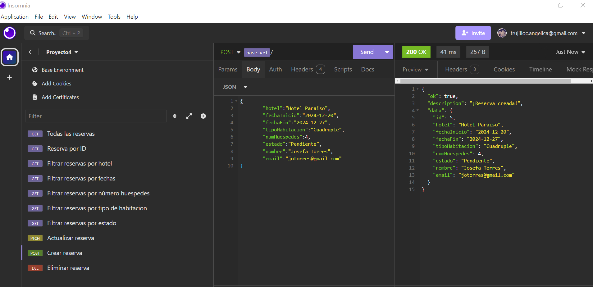
 
 En base a lo anterior se verifica si aparece en la lista al llamar todas las reservas, lo cual es correcto:
 
 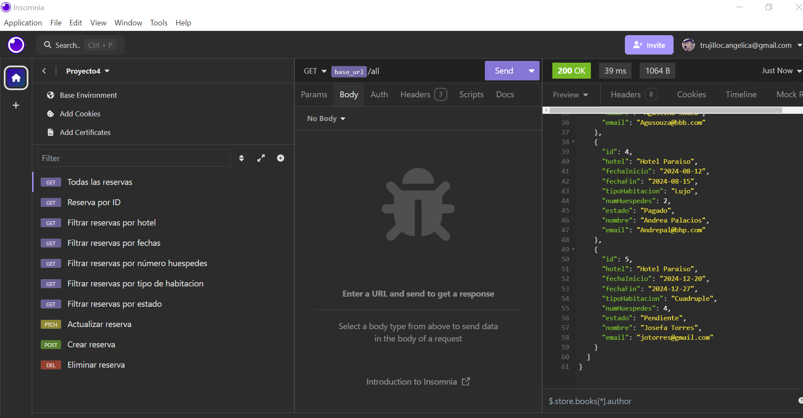

 Por último se crea la opción de eliminación, por medio de DELETE:

 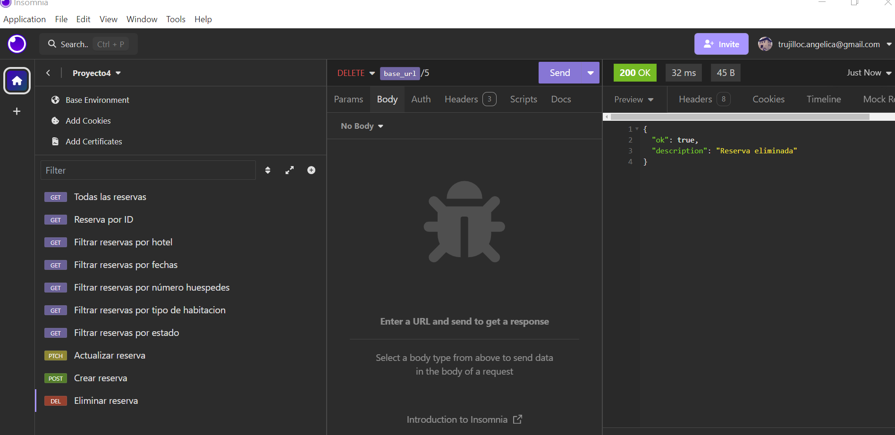
 

 
  ****
  
  ### 3. Conclusiones
 Para la preparación del proyecto de reservas hotekeras, se dio inicio con la estructura base propuesta, la cual se fue modificando en base a los requerimientos necesarios a medida que se desarrollaba el código para el modelo, controlador y las rutas. Fue un proyecto desafiante debido a las operaciones requeridas, más aún con las fechas. Luego de varias iteraciones y  revisiones se logró dar con el objetivo final del proyecto, además de incluir insomnia en el desarrollo, esto perimitiendo adquirir nuevos conocimientos sobre la herramienta.
  ****
*¡Gracias!*

